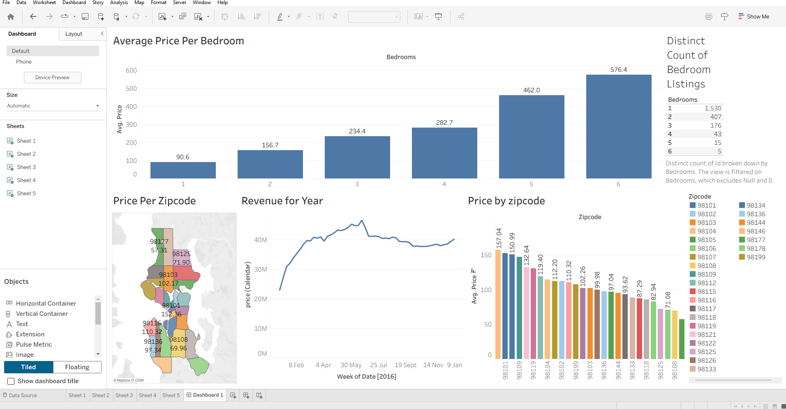

# Tableau_project
Tableau project 1

This is a guided project from https://youtu.be/j8FSP8XuFyk

to investigate the AirBnb price and trends in US. 

skills acquired: 
- visualizations
- labels and colours
- joins and relationship
- dashboard presentation

